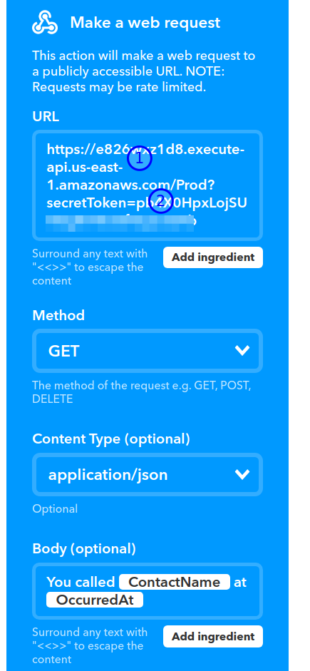

# ifttt-lambda-webhook-boilerplate
Some boilerplate code to reduce effort needed to setup a webhook receiver from IFTTT.

Deploy this with [sceptre](https://github.com/cloudreach/sceptre) by running: `sceptrea launch -y app`

Or deploy manually with this button:

The stack outputs a URL. Enter it as action in an IFTTT applet by as per this screenshot:

Notice a (secret) token in the url. Please specify this as parameter to the Cloudformation template and on IFTTT to validate that the request is really coming from the source you're expecting.
